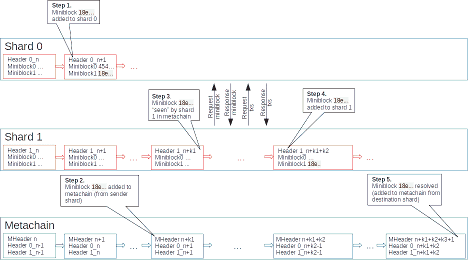

# 交叉碎片事务

> 原文：<https://docs.elrond.com/technology/cross-shard-transactions>

 为了深入了解跨碎片事务是如何执行的，以及碎片和元链之间的通信是如何发生的，我们将整个过程简化为两个碎片和一个元链。假设一个用户从他的钱包中生成一个交易，该钱包在 shard 0 中有一个地址，并且希望将 EGLD 发送给另一个用户，该用户的钱包在 shard 1 中有一个地址，处理跨 shard 交易需要下图中描述的步骤。

块的结构由包含关于块的信息(块随机数、轮次、提议者、验证者时间戳等)的块报头表示。)，以及包含实际事务的每个碎片的迷你块列表。每个 miniblock 包含的所有事务要么发送者在当前分片中，接收者在另一个分片中，要么发送者在不同的分片中，目的地在当前分片中。在我们的例子中，对于碎片 0 中的块，通常有 3 个迷你块:

*   迷你块 0:包含碎片 0 的内部碎片事务
*   迷你块 1:包含发送方在分片 0 中、目的地在分片 1 中的跨分片事务
*   miniblock 2:包含发送方在分片 1、目的地在分片 0 的跨分片事务。这些事务已经在发送方分片 1 中进行了处理，并将在当前分片中完成处理。

在一个块中具有相同发送器和接收器的迷你块的数量没有限制。这意味着具有相同发送者和接收者的多个迷你块可以出现在相同的块中。

## **加工**

目前，跨片执行中的原子处理单元是一个迷你块:要么立刻处理该迷你块的所有事务，要么不处理，该迷你块的执行将在下一轮重试。

我们的跨分片事务策略使用异步模型。验证和处理首先在发送方的分片中完成，然后在接收方的分片中完成。交易首先在发送方的碎片中分派，因为它可以完全验证从该碎片中的账户发起的任何交易——主要是当前余额。然后，在接收者的碎片中，节点只需要元链提供的执行证明，进行签名验证和重放攻击检查，最后为接收者更新余额，加上交易的金额。

碎片 0 处理迷你块 0 中的碎片内事务和一组跨碎片事务，这些事务的地址来自作为迷你块 1 中的接收者的碎片 1。块头和迷你块被发送到元链。元链通过创建新的元链块(元块)来公证来自碎片 0 的块，该元链块包含关于每个迷你块的以下信息:发送者碎片 ID、接收者碎片 ID、迷你块散列。

碎片 1 从元块获取迷你块 1 的散列，从碎片 0 请求迷你块，解析事务列表，请求丢失的事务(如果有的话)，在碎片 1 中执行相同的迷你块 1，并发送到元链结果块。经过公证后，可以认为交叉交易集已完成。

下图显示了完成交易所需的回合数。在小区块中的第一个包含直到最后一个小区块被公证之间的回合被考虑。

