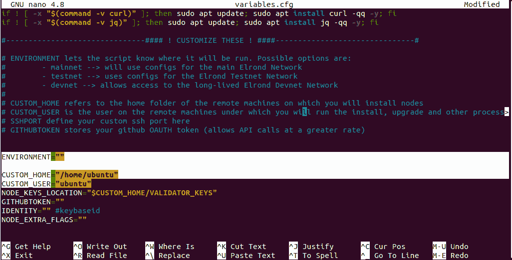

# 脚本和用户配置

> 原文：<https://docs.elrond.com/validators/elrond-go-scripts/config-scripts>

 埃尔隆德提供的脚本旨在简化安装埃尔隆德节点的过程。这个验证器脚本是一个访问 Mainnet、Devnet 和 Testnet 网络的通用脚本。

首先，您将从 Github 获得一份最新版本的脚本，并配置它以匹配您的本地设置。

## **下载埃尔隆德脚本**

```rust
cd ~
git clone https://github.com/ElrondNetwork/elrond-go-scripts 
```

## **正确配置脚本**

这些脚本需要设置一些配置才能正常工作。

首先也是最重要的，您需要您本地机器上的确切用户名。您可以通过运行`whoami`命令找到您当前的用户名，它会打印出来:

```rust
whoami 
```

接下来，在`variables.cfg`文件中，编辑并在以下变量中添加您的用户名:

*   将要使用的埃尔隆德网络:mainnet、testnet 或 devnet。
*   `CUSTOM_HOME`:这是指计算机上的文件夹，您将在其中安装您的节点。
*   `CUSTOM_USER`:这是您将运行安装、升级和其他过程的计算机上的用户名

在`nano`编辑器中打开`variables.cfg`:

```rust
cd ~/elrond-go-scripts/config
nano variables.cfg 
```

改变变量`ENVIRONMENT`、`CUSTOM_HOME`和`CUSTOM_USER`，如下图所示:



对于`CUSTOM_USER`变量，使用之前运行的`whoami`命令的输出。

保存文件并退出:

*   如果你用 **nano** 编辑，按`Ctrl+X`，然后按`y`，再按`Enter`
*   如果您正在使用 **vi** 或 **vim** 进行编辑，按住`Shift`并按下`z`两次。

## **保证用户权限**

确保你的用户已经启用了`sudo`并且可以访问，这样它就不会在每次执行时询问密码。

如果您确定这已经完成，请随意向前跳。否则，您需要将您的用户名添加到特殊列表中。

让我们将它添加到覆盖中:

```rust
sudo visudo -f /etc/sudoers.d/myOverrides 
```

现在，通过按下`Shift + G`导航到文件的结尾。接下来，按下`o`添加一个新行，并键入以下内容，用之前运行的`whoami`命令的输出替换`username`。

```rust
yourusername ALL=(ALL) NOPASSWD:ALL 
```

按下`Esc`结束，然后按住`Shift`并按下`z`两次，保存并关闭文件。

您的用户现在应该能够执行`sudo`命令了。