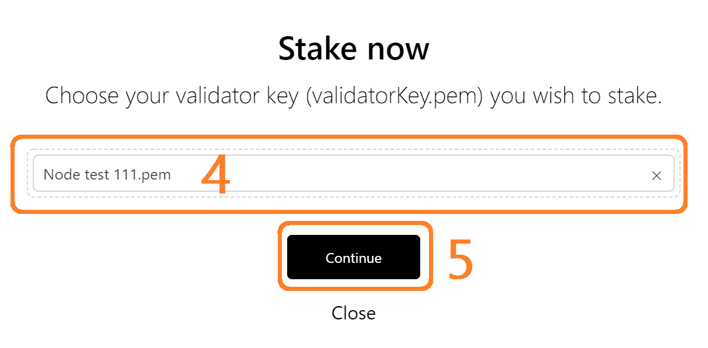
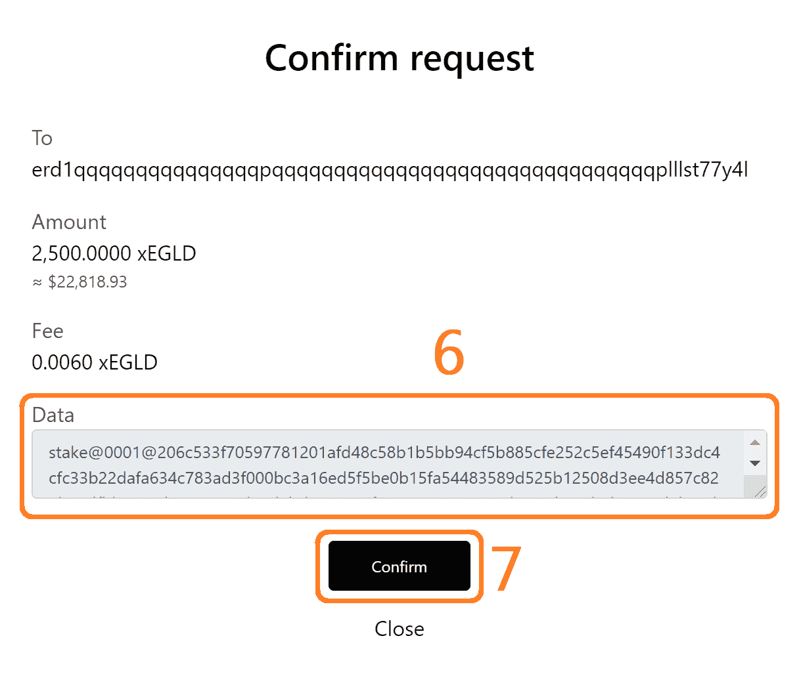
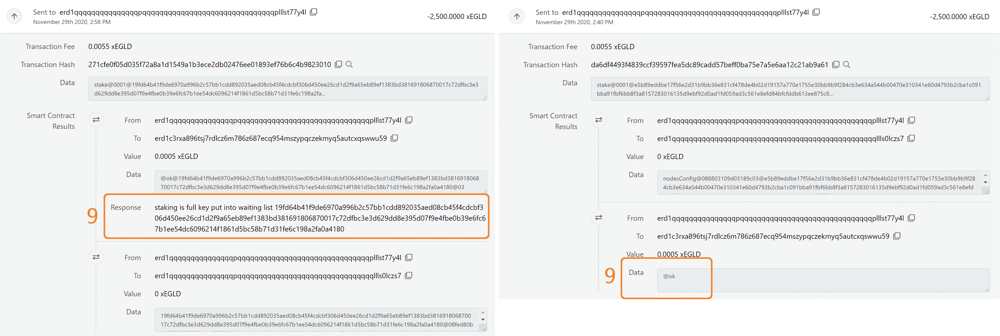
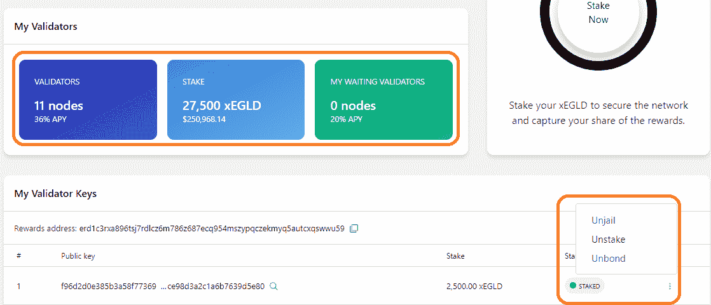

# 质押 

> 原文：<https://docs.elrond.com/validators/staking/staking>

 # **先决条件**

为了提交锁定交易，您必须具备以下条件:

*   每个节点 2500 埃及镑，每个节点 0.006 埃及镑作为交易费
*   每个节点的唯一的`validatorKey.pem`文件

您可以选择在[https://wallet.elrond.com](https://wallet.elrond.com/)通过在线钱包下注，或者使用`erdpy`下注。

## **跑马圈地**

1.  前往[https://wallet.elrond.com](https://wallet.elrond.com)并登录您的钱包
2.  转到验证部分
3.  按“立即下注”


4.  导航到的位置。pem 文件或拖放它
5.  按“继续”



6.  中的公钥自动填充堆栈交易数据。您提供的 pem 证书。私钥不会被触及，数据也不会离开您的浏览器。一旦您按下“确认”,只有包含此公共信息的交易才会被发送到网络
7.  按“确认”



8.  交易状态将显示在屏幕上，同时显示一条成功消息。看到成功消息后，单击“完成”。


9.  您可以在历史记录中查看交易。根据网络的当前堆栈容量，您将收到一条 OK 消息，表明您的节点已成为验证器，或者收到一条响应，表明网络堆栈已满，您的节点已被放入队列。



10.  将更新当前 wallet 中有关标记节点的信息
11.  您可以通过单击公钥旁边的三个垂直点来进一步与您的节点进行交互，这将显示一个菜单，用于执行 Unjail、Unstake 和 Unbond 等操作。



## **跑马圈地**

使用`erdpy`提交赌注交易避免了手动写入“数据”字段。相反，staking 交易由`erdpy`自动构建，并在单个命令中直接提交给网络。

在终端上发出以下命令，确保安装了`erdpy`:

```rust
erdpy --version 
```

该命令报告的版本必须至少为`erdpy 0.8.0`或更高。如果没有安装`erdpy`(`command not found`，或者版本较低，请按照[这些说明](/sdk-and-tools/erdpy/installing-erdpy)。

继续之前，确保`erdpy`已安装且为最新版本。

# **您的钱包 PEM 文件**

要在不通过使用在线Elrond钱包的情况下代表*发送交易，`erdpy`必须能够为您签名。因此，您必须使用钱包助记符生成一个 PEM 文件。*

请按照指南[导出钱包 PEM 文件](/sdk-and-tools/erdpy/deriving-the-wallet-pem-file)。确保您确切知道 PEM 文件是在哪里生成的，因为您需要在`erdpy`命令中引用它的路径。

生成 PEM 文件后，您可以直接从`erdpy`发出交易。

# **赌注交易**

以下命令假定您的 Wallet 的 PEM 文件以名称`walletKey.pem`保存在您发出命令的当前文件夹中。

使用`erdpy`提交锁定交易的命令如下:

```rust
erdpy --verbose validator stake --pem=walletKey.pem --value="<stake-value>" --validators-file=<validators-json-file> --proxy=https://gateway.elrond.com --estimate-gas --recall-nonce 
```

注意，我们使用的是`walletKey.pem`文件。此外，在执行该命令之前，您需要替换以下内容:

*   将`<stake-value>`替换为您下注的金额。您需要计算与您要定位的节点数量相关的值。有关如何操作的信息，请参见“通过钱包下注”部分的[开头。](/validators/staking/staking#staking-through-the-wallet)
*   用 JSON 文件替换`<validators-json-file>`,该文件列出了您正在为之进行标记的节点。这个 JSON 文件应该如下所示:

```rust
{
  "validators" : [
    {
      "pemFile": "valPem1.pem"
    },
    {
      "pemFile": "valPem2.pem"
    },
      {
      "pemFile": "valPem3.pem"
    }
  ]
} 
```

`pemFile`字段应该指向有效的验证器 PEM 文件。**注意，路径必须相对于 JSON 文件本身。**

还要注意，没有计算“气体极限”。如果向`erdpy`提供`--estimate-gas`参数，气体极限将被自动估算。

以下是一个节点的定位命令示例:

```rust
erdpy --verbose validator stake --pem=walletKey.pem --value="2500000000000000000000" --validators-file=my-validators.json --proxy=https://gateway.elrond.com --estimate-gas --recall-nonce 
```

##### 重要

在 **erdpy** 中指定`value`参数时，必须考虑**面额**。

对于两个节点，它变成这样:

```rust
erdpy --verbose validator stake --pem=walletKey.pem --value="5000000000000000000000" --validators-file=my-validators.json --proxy=https://gateway.elrond.com --estimate-gas --recall-nonce 
```

# **【奖励地址】参数**

当您提交赌注交易时，赌注 SmartContract 会记住您发送交易的钱包，来自您的赌注验证器的奖励将进入该钱包。这是*默认的*行为。在这种情况下，它将是您在前面的[“您的钱包 PEM 文件”](/validators/staking/staking#your-wallet-pem-file)小节中用来生成`walletKey.pem`文件的钱包。

或者，您可以告诉`erdpy`指定另一个钱包，将您的奖励转入其中。为此，您将需要您的奖励钱包(看起来像`erd1xxxxx…`)的**地址，您将使用`--reward-address`参数将它传递给`erdpy`。**

例如，指定了奖励地址的单个节点的 staking 命令如下所示:

```rust
erdpy --verbose validator stake --pem=walletKey.pem --reward-address="erd1sg4u62lzvgkeu4grnlwn7h2s92rqf8a64z48pl9c7us37ajv9u8qj9w8xg" --value="2500000000000000000000" --number-of-nodes=1  --nodes-public-keys="b617d8bc442bda59510f77e04a1680e8b2d3293c8c4083d94260db96a4d732deaaf9855fa0cef2273f5a67b4f442c725efc06a5d366b9f15a66da9eb8208a09c9ab4066b6b3d38c3cf1ea7fab6489a90713b3b56d87de68c6558c80d7533bf27" --proxy=https://gateway.elrond.com --estimate-gas --recall-nonce 
```

上述命令将提交一个赌注命令，并且还将通知赌注 SmartContract 应该将奖励转移到钱包`erd1sg4u62lzvgkeu4grnlwn7h2s92rqf8a64z48pl9c7us37ajv9u8qj9w8xg`。