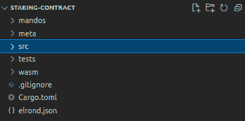
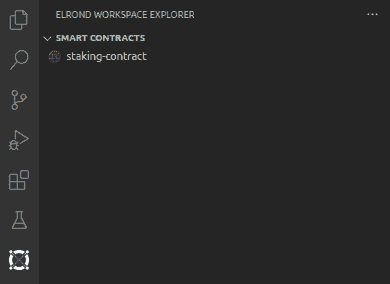
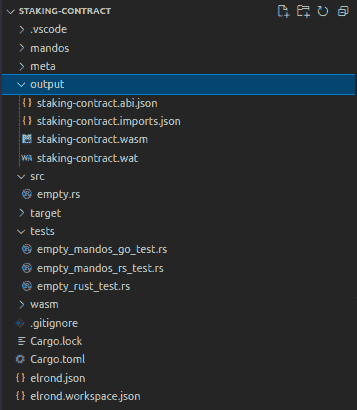
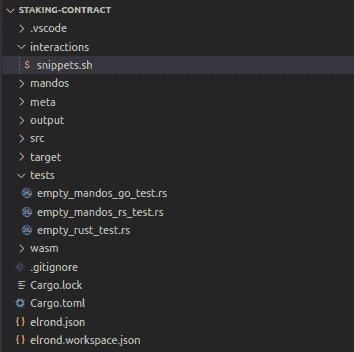

# 星际智能合约教程

> 原文：<https://docs.elrond.com/developers/tutorials/staking-contract>

 本教程旨在教你如何编写一个简单的 staking 契约，并说明和纠正新的智能契约开发人员可能会陷入的常见陷阱。

如果你发现这里还有什么没有回答的，欢迎在 https://t.me/ElrondDevelopers 的埃尔隆德开发者电报频道提问

## 先决条件

### erdpy

首先，您需要安装 erd py:[https://docs . elrond . com/SDK-and-tools/erd py/installing-erd py/](https://docs.elrond.com/sdk-and-tools/erdpy/installing-erdpy/)

如果您已经安装了 erdpy，请确保使用与安装相同的说明将其更新到最新版本。

我们将使用 erdpy 与我们的合同进行交互，因此，如果您需要有关我们将执行的一些步骤的更多详细信息，您可以在这里查看有关每个命令的详细解释:[https://docs . elrond . com/SDK-and-tools/erd py/smart-contract-interactions/](https://docs.elrond.com/sdk-and-tools/erdpy/smart-contract-interactions/)

### 锈

一旦安装了 erdpy，您还必须通过它安装 Rust，以及用于测试的 VM 工具:

```rust
erdpy deps install rust

erdpy deps install vmtools --overwrite 
```

如果您已经安装了 Rust 而没有安装 erdpy，那么在构建您的智能合约时，您可能会遇到一些问题。建议卸载 Rust，改通过 erdpy 安装。

错误示例:

```rust
error[E0554]: #![feature] may not be used on the stable release channel
--> /home/user/elrondsdk/vendor-rust/registry/src/github.com-1ecc6299db9ec823/elrond-wasm-derive-0.33.0/src/lib.rs:4:12 
```

### VSCode 和 rust-analyser 扩展

虚拟代码:[https://code.visualstudio.com/](https://code.visualstudio.com/)

假设你在 Ubuntu 上，下载`.deb`版本。转到该文件夹:

*   在终端中打开文件夹
*   运行以下命令:`sudo dpkg -i downloaded_file_name`

铁锈分析仪:[https://marketplace.visualstudio.com/items?itemName = rust-lang . rust-analyzer](https://marketplace.visualstudio.com/items?itemName=rust-lang.rust-analyzer)

https://marketplace.visualstudio.com/items?埃尔隆德 VSCode 扩展:[itemName = elrond . vs code-elrond-ide](https://marketplace.visualstudio.com/items?itemName=Elrond.vscode-elrond-ide)

两者都可以从 VSCode 中的“扩展”菜单轻松安装。

## 创建合同

在要创建智能合约的文件夹中运行以下命令:

```rust
erdpy contract new staking-contract --template empty 
```

打开 VSCode，选择文件->打开文件夹，打开新创建的`staking-contract`文件夹。

你应该有如下的结构:


现在，注释`./tests/empty_rust_test.rs`文件中的所有代码(ctrl + "A "，然后 ctrl + "/")。否则，当我们修改契约的代码时，它会不断弹出错误。

## 设置工作区

现在，为了让所有的扩展正常工作，我们必须设置我们的工作空间。按下`ctrl + shift + P`并从菜单中选择“埃尔隆德:设置工作区”选项即可。在弹出菜单中选择“是”选项。

现在，让我们打开埃尔隆德 VSCode 扩展并尝试构建我们的契约，看看是否一切都设置正确。转到扩展的选项卡，右键单击“staking-contract”并选择“Build Contract”选项:


或者，您可以从 VSCode 终端自己运行`erdpy --verbose contract build`。该命令应在 staking-contract 文件夹中运行。

构建完成后，我们的文件夹应该是这样的:


创建了一个名为`output`的新文件夹，其中包含已编译的合同代码。稍后将详细介绍这一点。现在，让我们继续。

## 你的第一条锈线

目前，我们只有一份空合同。不是很有用吧？所以让我们为它添加一些简单的代码。因为这是一个桩合同，我们期望有一个`stake`函数，对吗？

首先，删除`./src/empty.rs`文件中的所有代码，替换为:

```rust
#![no_std]

elrond_wasm::imports!();

#[elrond_wasm::contract]
pub trait StakingContract {
    #[init]
    fn init(&self) {}

    #[payable("EGLD")]
    #[endpoint]
    fn stake(&self) {}
} 
```

因为我们希望这个函数可以被用户调用，所以我们必须用`#[endpoint]`来注释它。此外，因为我们希望能够收到付款，所以我们也将其标记为`#[payable("EGLD)]`。现在，我们将使用 EGLD 作为我们的赌注标记。

##### 注

该合同不需要为它接收端点调用的付款而支付。合同层的应付款标志仅用于在没有端点调用的情况下接收付款。

现在，是时候为该函数添加一个实现了。我们需要看到用户付了多少钱，并在存储中保存他们的赌注信息。我们以这段代码结束:

```rust
#![no_std]

elrond_wasm::imports!();

#[elrond_wasm::contract]
pub trait StakingContract {
    #[init]
    fn init(&self) {}

    #[payable("EGLD")]
    #[endpoint]
    fn stake(&self) {
        let payment_amount = self.call_value().egld_value();
        require!(payment_amount > 0, "Must pay more than 0");

        let caller = self.blockchain().get_caller();
        self.staking_position(caller.clone()).set(&payment_amount);
        self.staked_addresses().insert(caller.clone());
    }

    #[view(getStakedAddresses)]
    #[storage_mapper("stakedAddresses")]
    fn staked_addresses(&self) -> UnorderedSetMapper<ManagedAddress>;

    #[view(getStakingPosition)]
    #[storage_mapper("stakingPosition")]
    fn staking_position(&self, addr: ManagedAddress) -> SingleValueMapper<BigUint>;
} 
```

`require!`是一个宏，是`if !condition { signal_error(msg) }`的快捷方式。发出错误信号将终止执行，并恢复对内部状态所做的任何更改，包括来自和去往 SC 的令牌传输。在这种情况下，如果用户没有支付任何费用，就没有理由继续。

我们还为存储映射器添加了#[view]注释，这样我们以后可以对这些存储条目执行查询。你可以在这里阅读更多关于注释的内容:[https://docs . elrond . com/developers/developer-reference/elrond-wasm-annotations/](https://docs.elrond.com/developers/developer-reference/elrond-wasm-annotations/)

此外，如果您对使用的一些功能或存储映射器感到困惑，您可以在此处阅读更多信息:

*   [https://docs . elrond . com/developers/developer-reference/elrond-wasm-API-functions/](https://docs.elrond.com/developers/developer-reference/elrond-wasm-api-functions/)
*   [https://docs . elrond . com/developers/developer-reference/storage-mappers/](https://docs.elrond.com/developers/developer-reference/storage-mappers/)

现在，我故意在这里写了一些糟糕的代码。你能看出我们可以做出的改进吗？

首先，不需要最后一个*克隆*。如果你一直在克隆变量，那么你需要花些时间阅读 Rust book 的 Rust ownership 章节:[https://doc . Rust-lang . org/book/ch04-00-understanding-ownership . html](https://doc.rust-lang.org/book/ch04-00-understanding-ownership.html)以及关于从 Rust 框架中克隆类型的含义:[https://docs . elrond . com/developers/best-practices/biguint-operations/](https://docs.elrond.com/developers/best-practices/biguint-operations/)

其次，`staking_position`不需要`addr`参数拥有的值。我们可以参考一下。

最后，还有一个逻辑错误。如果用户下注两次会怎么样？没错，它们的位置将被最新的值覆盖。因此，我们需要使用`update`方法，在当前金额的基础上增加最新的股份金额。

解决了上述问题后，我们得到了下面的代码:

```rust
#![no_std]

elrond_wasm::imports!();

#[elrond_wasm::contract]
pub trait StakingContract {
    #[init]
    fn init(&self) {}

    #[payable("EGLD")]
    #[endpoint]
    fn stake(&self) {
        let payment_amount = self.call_value().egld_value();
        require!(payment_amount > 0, "Must pay more than 0");

        let caller = self.blockchain().get_caller();
        self.staking_position(&caller)
            .update(|current_amount| *current_amount += payment_amount);
        self.staked_addresses().insert(caller);
    }

    #[view(getStakedAddresses)]
    #[storage_mapper("stakedAddresses")]
    fn staked_addresses(&self) -> UnorderedSetMapper<ManagedAddress>;

    #[view(getStakingPosition)]
    #[storage_mapper("stakingPosition")]
    fn staking_position(&self, addr: &ManagedAddress) -> SingleValueMapper<BigUint>;
} 
```

### 空 init 函数是怎么回事？

每个智能契约都需要有一个用`#[init]`注释的函数。在部署和升级时调用此函数。目前，我们不需要它内部的逻辑，但我们仍然需要有这个功能。

## 在 devnet 上试用

为了部署并与契约交互，我们需要编写一些代码片段。创建一个`interactions`文件夹，并在其中创建一个`snippets.sh`文件。这是使用代码片断的标准，这样，它们也能被埃尔隆德 IDE 扩展识别。稍后会有更多的介绍。你的新文件夹结构应该是这样的:


### 创建 devnet 钱包

##### 注

如果您已经安装了 devnet wallet，可以跳过这一部分。

让我们创建一个 devnet 钱包。进入[https://devnet-wallet.elrond.com/](https://devnet-wallet.elrond.com/)，选择“创建钱包”。保存你的 24 个单词(按给定顺序！)，并为您的密钥库文件创建一个密码。

现在，我们可以使用带密码的 keystore 文件，但是使用 PEM 文件更方便。要根据您的机密短语生成 PEM 文件，请遵循以下说明:[https://docs . elrond . com/SDK-and-tools/erd py/derivating-the-wallet-PEM-file/](https://docs.elrond.com/sdk-and-tools/erdpy/deriving-the-wallet-pem-file/)

TL；DR:打开终端并运行以下命令。按顺序写出您的秘密短语单词:

```rust
erdpy --verbose wallet derive ./tutorialKey.pem --mnemonic 
```

##### 注

你得在单词之间按“空格”，而不是“回车”！

### 调配合同

现在我们已经创建了一个钱包，是时候部署我们的合同了。打开您的`snippets.sh`文件，并添加以下内容:

```rust
USER_PEM="~/Downloads/tutorialKey.pem"
PROXY="https://devnet-gateway.elrond.com"
CHAIN_ID="D"

deploy() {
    erdpy --verbose contract deploy --project=${PROJECT} \
    --recall-nonce --pem=${USER_PEM} \
    --gas-limit=10000000 \
    --send --outfile="deploy-devnet.interaction.json" \
    --proxy=${PROXY} --chain=${CHAIN_ID} || return
} 
```

##### 注

如果你想使用 testnet，代理应该是“[https://testnet-gateway.elrond.com](https://testnet-gateway.elrond.com)”，链 ID 应该是“T”。对于 mainnet，它将是 https://gateway.elrond.com 的“[”和链 ID“1”。](https://gateway.elrond.com)

更多细节可以在这里找到[。](/developers/constants/)

您唯一需要编辑的是 USER_PEM 变量和之前创建的 PEM 文件的路径。

为了运行这个代码片段，我们将再次使用埃尔隆德 IDE 扩展。从左侧菜单中打开 VSCode 中的扩展，右键单击合同名称，并选择`Run Contract Snippet`选项。这应该在顶部打开一个菜单:


目前，我们只有一个选项，因为我们的文件中只有一个函数，但是我们在 snippets.sh 文件中编写的任何 bash 函数都会出现在那里。现在，选择 deploy 选项，让我们部署契约。

### 账号没有找到？但是我刚刚创造了钱包！

您将看到如下所示的错误:

```rust
CRITICAL:cli:Proxy request error for url [https://devnet-gateway.elrond.com/transaction/send]: {'data': None, 'error': 'transaction generation failed: account not found for address erd1... and shard 1, err: account was not found', 'code': 'internal_issue'} 
```

这是因为你的账户中没有 EGLD，所以就区块链而言，这个账户是不存在的，因为它没有往来交易。

但是，如果部署失败，您怎么会看到合同的地址呢？

```rust
INFO:cli.contracts:Contract address: erd1qqqqqqqqqqqqq...
INFO:utils:View this contract address in the Elrond Devnet Explorer: https://devnet-explorer.elrond.com/accounts/erd1qqqqqqqqqqqqq... 
```

这是因为合同地址是根据部署者的地址和他们的当前帐户 nonce 计算的。它们不是随机的。所以 erdpy 预先计算地址并在终端中显示。此外，部署的契约总是与部署者在同一个碎片中。

### 在 devnet 上获取 EGLD

有两种方法可以在 devnet 上获得 EGLD:

*   通过 devnet 钱包
*   通过外部水龙头

#### 通过 devnet wallet 获取 EGLD

去[https://devnet-wallet.elrond.com](https://devnet-wallet.elrond.com)用你的 PEM 文件登录你的 devnet 账户。在左侧菜单中，选择【水龙头】选项:
T3】

请求代币。几秒钟后，刷新页面，您的钱包中应该有 30 xEGLD。

#### 通过外部水龙头获取 EGLD

前往[https://r3d4.fr/faucet](https://r3d4.fr/faucet)并提交请求:
T3】

确保您选择了“devnet”并输入您的地址！这可能需要一点时间，取决于水龙头有多忙。

### 调配合同，第二次尝试

现在，区块链知道了我们的帐户，是时候再次尝试部署了。再次运行`deploy`片段，让我们看看结果。请务必保存合同地址。erdpy 将在控制台中为您打印它:

```rust
INFO:cli.contracts:Contract address: erd1qqqqqqqqqqqqq... 
```

或者，您可以在资源管理器的日志选项卡中检查地址，即`SCDeploy`事件。

#### 太多气体误差？

一切都应该正常工作，但是您会看到这条消息:


这不是错误。这仅仅意味着你提供的汽油比需要的多，所以所有的汽油都被消耗掉了，而不是剩余的被归还给你。这样做是为了保护网络免受某些攻击。例如，可以总是提供最大气体限制，并且仅使用非常少的气体，从而显著降低网络的吞吐量。

## 第一桩

让我们为 staking 函数添加一个代码片段:

```rust
USER_PEM="~/Downloads/tutorialKey.pem"
PROXY="https://devnet-gateway.elrond.com"
CHAIN_ID="D"

SC_ADDRESS=erd1qqqqqqqqqqqqq...
STAKE_AMOUNT=1

deploy() {
    erdpy --verbose contract deploy --project=${PROJECT} \
    --recall-nonce --pem=${USER_PEM} \
    --gas-limit=10000000 \
    --send --outfile="deploy-devnet.interaction.json" \
    --proxy=${PROXY} --chain=${CHAIN_ID} || return
}

stake() {
    erdpy --verbose contract call ${SC_ADDRESS} \
    --proxy=${PROXY} --chain=${CHAIN_ID} \
    --send --recall-nonce --pem=${USER_PEM} \
    --gas-limit=10000000 \
    --value=${STAKE_AMOUNT} \
    --function="stake"
} 
```

为了支付 EGLD，使用了`--value`参数，正如您可以猜到的，使用了`--function`参数来选择我们想要调用的端点。

我们现在已经成功地钉死了 1 个 EGLD...或者我们有吗？如果我们看一下交易，情况就不完全是这样:


### 我向 SC 发送了 1 个 EGLD，但发送的是 0.000000000000001 个 EGLD？

这是因为 EGLD 有 18 位小数。因此，要发送 1 个 EGLD，您实际上必须发送一个等于 10000000000000000 的值(即 1 * 10^18).区块链只适用于无符号数字。不允许浮点数。浏览器用浮点显示余额的唯一原因是，告诉某人他们有 1 个 EGLD 而不是 100000000000000000 个 EGLD，这样更方便用户，但是在内部，只使用整数值。

### 但是我怎么把 0.5 EGLD 发给 SC 呢？

因为我们知道 EGLD 有 18 位小数，所以我们只需将 0.5 乘以 10^18，得到 500000000000000。

## 实际上跑马圈地 1 EGLD

为此，我们只需更新代码片段中的`STAKE_AMOUNT`变量。这应该是:`STAKE_AMOUNT=1000000000000000000`。

现在让我们再次尝试下注:


## 查询视图功能

为了执行智能契约查询，我们还使用 erdpy。让我们将以下内容添加到代码片段文件中:

```rust
USER_ADDRESS=erd1...

getStakeForAddress() {
    erdpy --verbose contract query ${SC_ADDRESS} \
    --proxy=${PROXY} \
    --function="getStakingPosition" \
    --arguments ${USER_ADDRESS}
} 
```

##### 注

您根本不需要 PEM 文件或帐户来执行查询。注意，这个调用也不需要链 ID。

##### 注

因为不需要 PEM 文件，所以没有 VM 查询的“调用者”。试图在查询函数中使用`self.blockchain().get_caller()`将返回 SC 自己的地址。

用您的地址替换`USER_ADDRESS`值。现在，根据供应链的内部状态，让我们看看我们的赌注金额:

```rust
getStakeForAddress
[
    {
        "base64": "DeC2s6dkAAE=",
        "hex": "0de0b6b3a7640001",
        "number": 1000000000000000001
    }
] 
```

我们得到预期的数量，1 EGLD，加上我们发送的初始 10^-18 EGLD。

现在让我们也查询一下赌注者列表:

```rust
getAllStakers() {
    erdpy --verbose contract query ${SC_ADDRESS} \
    --proxy=${PROXY} \
    --function="getStakedAddresses"
} 
```

运行该函数应该会产生如下结果:

```rust
getAllStakers
[
    {
        "base64": "nKGLvsPooKhq/R30cdiu1SRbQysprPITCnvi04n0cR0=",
        "hex": "9ca18bbec3e8a0a86afd1df471d8aed5245b432b29acf2130a7be2d389f4711d",
        "number": 70846231242182541417246304875524977991498122361356467219989042906898688667933
    }
] 
```

...但是这个值是什么呢？如果我们试图将`9ca18bbec3e8a0a86afd1df471d8aed5245b432b29acf2130a7be2d389f4711d`转换成 ASCII，就会得到乱码。那么我们漂亮的 erd1 地址怎么了？

### 将 erd1 地址转换为十六进制

智能合约从不使用 erd1 地址格式，而是使用十六进制格式。这不是 ASCII 到十六进制的转换。这是一个 bech32 到 ASCII 的转换。

但是，为什么前面的查询有效呢？

```rust
getStakeForAddress() {
    erdpy --verbose contract query ${SC_ADDRESS} \
    --proxy=${PROXY} \
    --function="getStakingPosition" \
    --arguments ${USER_ADDRESS}
} 
```

这是因为 erdpy 自动检测 erd1 地址并将其转换为十六进制。要自己执行这些转换，还可以使用 erdpy:

bech32 是 hex

```rust
erdpy wallet bech32 --decode erd1... 
```

在前面的例子中，我们使用的地址是:erd 1 njs ch 0 krazs 2s 6 harh 68 rk 9 w 65j 9 kset 9 xk 0 yyc 2003 d8z 05 wyssmmnn 76

现在让我们试着用 erdpy 解码:

```rust
erdpy wallet bech32 --decode erd1njsch0krazs2s6harh68rk9w65j9kset9xk0yyc2003d8z05wywsmmnn76
9ca18bbec3e8a0a86afd1df471d8aed5245b432b29acf2130a7be2d389f4711d 
```

这正是我们从智能合同中获得的价值。现在让我们反过来试试。

hex 是 bech32

```rust
erdpy wallet bech32 --encode hex_address 
```

使用前面的示例运行命令，我们应该得到相同的初始地址:

```rust
erdpy wallet bech32 --encode 9ca18bbec3e8a0a86afd1df471d8aed5245b432b29acf2130a7be2d389f4711d
erd1njsch0krazs2s6harh68rk9w65j9kset9xk0yyc2003d8z05wywsmmnn76 
```

## 添加拆分功能

目前，用户只能下注，但他们实际上无法拿回他们的 EGLD...一点也不。让我们在 SC 中添加拆分端点:

```rust
#[endpoint]
fn unstake(&self) {
    let caller = self.blockchain().get_caller();
    let stake_mapper = self.staking_position(&caller);

    let caller_stake = stake_mapper.get();
    if caller_stake == 0 {
        return;
    }

    self.staked_addresses().swap_remove(&caller);
    stake_mapper.clear();

    self.send().direct_egld(&caller, &caller_stake);
} 
```

您可能会注意到变量`stake_mapper`。提醒您一下，映射器的定义是这样的:

```rust
#[storage_mapper("stakingPosition")]
fn staking_position(&self, addr: &ManagedAddress) -> SingleValueMapper<BigUint>; 
```

用纯粹的术语来说，这是我们契约特征的一个方法，带有一个参数，返回一个`SingleValueMapper<BigUint>`。所有的映射器只不过是提供存储 API 接口的结构类型。

那么，为什么要将映射器保存在变量中呢？

### 存储映射器类型的更好用法

每次访问`self.staking_position(&addr)`时，必须通过将静态字符串`stakingPosition`与给定的`addr`参数连接起来，再次构建存储键。映射器在内部保存它的密钥，所以如果我们重用同一个映射器，密钥只构造一次。

这为我们节省了以下操作:

```rust
let mut key = ManagedBuffer::new_from_bytes(b"stakingPosition");
key.append(addr.as_managed_buffer()); 
```

相反，我们只是重复使用我们先前构建的密钥。这可以极大地提高性能，尤其是对于具有多个参数的映射器。对于没有参数的映射器来说，改进很小，但是仍然值得考虑。

### 分批拆垛

一些用户可能只想取消一部分令牌，所以我们可以简单地添加一个`unstake_amount`参数:

```rust
#[endpoint]
fn unstake(&self, unstake_amount: BigUint) {
    let caller = self.blockchain().get_caller();
    let remaining_stake = self.staking_position(&caller).update(|staked_amount| {
        require!(
            unstake_amount > 0 && unstake_amount <= *staked_amount,
            "Invalid unstake amount"
        );
        *staked_amount -= &unstake_amount;

        staked_amount.clone()
    });
    if remaining_stake == 0 {
        self.staked_addresses().swap_remove(&caller);
    }

    self.send().direct_egld(&caller, &unstake_amount);
} 
```

您可能已经注意到，代码发生了很大的变化。我们还需要考虑无效的用户输入，所以我们添加了一个`require!`语句。此外，由于我们不再需要简单地“清除”存储，我们使用了`update`方法，该方法允许我们通过可变引用来更改当前存储的值。

`update`和做`get`是一样的，接下来是计算，然后是`set`，只是紧凑了很多。此外，它还允许我们从给定的闭包返回我们想要的任何东西，所以我们用它来检测这是否是一个完整的分解。

```rust
pub fn update<R, F: FnOnce(&mut T) -> R>(&self, f: F) -> R {
    let mut value = self.get();
    let result = f(&mut value);
    self.set(value);
    result
} 
```

### 可选参数

为了提高一点性能，我们可以将`unstake_amount`作为可选参数，缺省值为 full unstake。

```rust
#[endpoint]
fn unstake(&self, opt_unstake_amount: OptionalValue<BigUint>) {
    let caller = self.blockchain().get_caller();
    let stake_mapper = self.staking_position(&caller);
    let unstake_amount = match opt_unstake_amount {
        OptionalValue::Some(amt) => amt,
        OptionalValue::None => stake_mapper.get(),
    };

    let remaining_stake = stake_mapper.update(|staked_amount| {
        require!(
            unstake_amount > 0 && unstake_amount <= *staked_amount,
            "Invalid unstake amount"
        );
        *staked_amount -= &unstake_amount;

        staked_amount.clone()
    });
    if remaining_stake == 0 {
        self.staked_addresses().swap_remove(&caller);
    }

    self.send().direct_egld(&caller, &unstake_amount);
} 
```

这使得如果有人想执行一个完整的分解，他们可以简单地不给出参数。

### 解散我们的 devnet 令牌

现在我们已经添加了 unstake 函数，让我们在 devnet 上测试一下。直接通过埃尔隆德 IDE 扩展或 erdpy 再次构建您的 SC，并将 unstake 函数添加到我们的 snippets.rs 文件:

```rust
UNSTAKE_AMOUNT=500000000000000000

unstake() {
    erdpy --verbose contract call ${SC_ADDRESS} \
    --proxy=${PROXY} --chain=${CHAIN_ID} \
    --send --recall-nonce --pem=${USER_PEM} \
    --gas-limit=10000000 \
    --function="unstake" \
    --arguments ${UNSTAKE_AMOUNT}
} 
```

现在运行这个函数，你会得到这个结果:


...但是为什么呢？我们刚刚添加了功能！嗯，我们可能已经把它添加到我们的代码中了，但是 devnet 上的契约仍然有我们的旧代码。那么，我们如何上传我们的新代码？

## 升级智能合约

因为我们添加了一些新功能，所以我们还想更新当前部署的实现。将升级代码段添加到 snippets.sh 并运行它:

```rust
upgrade() {
    erdpy --verbose contract upgrade ${SC_ADDRESS} \
    --project=${PROJECT} \
    --recall-nonce --pem=${USER_PEM} \
    --gas-limit=20000000 \
    --send --outfile="upgrade-devnet.interaction.json" \
    --proxy=${PROXY} --chain=${CHAIN_ID} || return
} 
```

##### 注

记住新上传代码的`#[init]`函数也会在升级时被调用。现在，这并不重要，因为我们的 init 函数什么也不做，但是值得记住。

##### 注

所有存储都在升级，因此请确保您对存储映射所做的任何存储更改都是向后兼容的！

## 再试试拆分

尝试再次运行`unstake`片段。这一次，它应该工作得很好。之后，让我们通过`getStakeForAddress`查询我们的下注金额，看看它是否正确更新了我们的金额:

```rust
getStakeForAddress
[
    {
        "base64": "BvBbWdOyAAE=",
        "hex": "06f05b59d3b20001",
        "number": 500000000000000001
    }
] 
```

我们有 1 个 EGLD，我们已经卸下了 0.5 个 EGLD。现在我们有 0.5 亿英镑的赌注。(加上我们最初下注的 EGLD 的额外 1 部分)。

## 【解散】没有争论

让我们也测试一下可选的参数功能。从代码片段中删除`--arguments`行，然后再次运行它。

```rust
unstake() {
    erdpy --verbose contract call ${SC_ADDRESS} \
    --proxy=${PROXY} --chain=${CHAIN_ID} \
    --send --recall-nonce --pem=${USER_PEM} \
    --gas-limit=10000000 \
    --function="unstake"
} 
```

让我们随后也查询`getStakeForAddress`和`getAllStakers`,看看状态是否被正确清除:

```rust
getStakeForAddress
[
    ""
] 
```

```rust
getAllStakers
[] 
```

正如你所看到的，我们分别得到一个空结果(这意味着值 0)和一个空数组。

## 书写生锈测试

正如你可能已经注意到的，在每一个小的变化之后，保持升级合同是一件相当麻烦的事情，尤其是如果我们想要做的只是测试一个新的特性。让我们回顾一下到目前为止我们所做的工作:

*   部署我们的合同
*   桩
*   部分拆垛
*   完全卸垛

##### 注

关于 Rust 测试更详细的解释可以在这里找到:[https://docs . elrond . com/developers/developer-reference/Rust-testing-framework/](https://docs.elrond.com/developers/developer-reference/rust-testing-framework/)

为了测试前面描述的场景，我们需要一个用户地址和一个新的测试函数。用以下内容替换`./tests/empty_rust_test.rs`文件的内容:

```rust
use elrond_wasm::{elrond_codec::multi_types::OptionalValue, types::Address};
use elrond_wasm_debug::{
    managed_address, managed_biguint, rust_biguint, testing_framework::*, DebugApi,
};
use staking_contract::*;

const WASM_PATH: &'static str = "output/staking-contract.wasm";
const USER_BALANCE: u64 = 1_000_000_000_000_000_000;

struct ContractSetup<ContractObjBuilder>
where
    ContractObjBuilder: 'static + Copy + Fn() -> staking_contract::ContractObj<DebugApi>,
{
    pub b_mock: BlockchainStateWrapper,
    pub owner_address: Address,
    pub user_address: Address,
    pub contract_wrapper:
        ContractObjWrapper<staking_contract::ContractObj<DebugApi>, ContractObjBuilder>,
}

impl<ContractObjBuilder> ContractSetup<ContractObjBuilder>
where
    ContractObjBuilder: 'static + Copy + Fn() -> staking_contract::ContractObj<DebugApi>,
{
    pub fn new(sc_builder: ContractObjBuilder) -> Self {
        let rust_zero = rust_biguint!(0u64);
        let mut b_mock = BlockchainStateWrapper::new();
        let owner_address = b_mock.create_user_account(&rust_zero);
        let user_address = b_mock.create_user_account(&rust_biguint!(USER_BALANCE));
        let sc_wrapper =
            b_mock.create_sc_account(&rust_zero, Some(&owner_address), sc_builder, WASM_PATH);

        // simulate deploy
        b_mock
            .execute_tx(&owner_address, &sc_wrapper, &rust_zero, |sc| {
                sc.init();
            })
            .assert_ok();

        ContractSetup {
            b_mock,
            owner_address,
            user_address,
            contract_wrapper: sc_wrapper,
        }
    }
}

#[test]
fn stake_unstake_test() {
    let mut setup = ContractSetup::new(staking_contract::contract_obj);
    let owner_addr = setup.owner_address.clone();
    let user_addr = setup.user_address.clone();

    setup
        .b_mock
        .check_egld_balance(&user_addr, &rust_biguint!(USER_BALANCE));
    setup
        .b_mock
        .check_egld_balance(setup.contract_wrapper.address_ref(), &rust_biguint!(0));

    // stake full
    setup
        .b_mock
        .execute_tx(
            &user_addr,
            &setup.contract_wrapper,
            &rust_biguint!(USER_BALANCE),
            |sc| {
                sc.stake();

                assert_eq!(
                    sc.staking_position(&managed_address!(&user_addr)).get(),
                    managed_biguint!(USER_BALANCE)
                );
            },
        )
        .assert_ok();

    setup
        .b_mock
        .check_egld_balance(&user_addr, &rust_biguint!(0));
    setup.b_mock.check_egld_balance(
        setup.contract_wrapper.address_ref(),
        &rust_biguint!(USER_BALANCE),
    );

    // unstake partial
    setup
        .b_mock
        .execute_tx(
            &user_addr,
            &setup.contract_wrapper,
            &rust_biguint!(0),
            |sc| {
                sc.unstake(OptionalValue::Some(managed_biguint!(USER_BALANCE / 2)));

                assert_eq!(
                    sc.staking_position(&managed_address!(&user_addr)).get(),
                    managed_biguint!(USER_BALANCE / 2)
                );
            },
        )
        .assert_ok();

    setup
        .b_mock
        .check_egld_balance(&user_addr, &rust_biguint!(USER_BALANCE / 2));
    setup.b_mock.check_egld_balance(
        setup.contract_wrapper.address_ref(),
        &rust_biguint!(USER_BALANCE / 2),
    );

    // unstake full
    setup
        .b_mock
        .execute_tx(
            &user_addr,
            &setup.contract_wrapper,
            &rust_biguint!(0),
            |sc| {
                sc.unstake(OptionalValue::None);

                assert_eq!(
                    sc.staking_position(&managed_address!(&user_addr)).get(),
                    managed_biguint!(0)
                );
            },
        )
        .assert_ok();

    setup
        .b_mock
        .check_egld_balance(&user_addr, &rust_biguint!(USER_BALANCE));
    setup
        .b_mock
        .check_egld_balance(setup.contract_wrapper.address_ref(), &rust_biguint!(0));
} 
```

我们在 setup 结构中添加了一个`user_address`字段，它是由他们帐户中的`USER_BALANCE` EGLD 开始的。

##### 注

在测试中，我们将使用小数字来表示余额，因为没有理由使用大数字。对于这个测试，我们使用 1 个 EGLD 来平衡用户。

然后，我们押下用户的全部余额，未押一半，然后完全未押。每次交易后，我们都会检查 SC 的内部赌注存储，并分别检查用户和 SC 的余额。

### 运行测试

要运行测试，您可以点击测试名称下的`Run Test`按钮。

还有一个`Debug`按钮，可以用来调试智能合约。更多细节请点击这里:[https://docs . elrond . com/developers/developer-reference/rust-smart-contract-debugging/](https://docs.elrond.com/developers/developer-reference/rust-smart-contract-debugging/)

或者，您可以通过在 VSCode 终端的`./staking-contract`文件夹中运行以下命令来运行文件中的所有测试:

```rust
cargo test --test empty_rust_test 
```

其中`empty_rust_test`是包含测试的文件的名称。

## 赌注奖励

现在，还没有动力让 EGLD 加入这个智能合同。假设我们想给每个赌注者 10%的 APY(年百分比收益率)。例如，如果有人下注 100 埃及镑，他们每年将总共得到 10 埃及镑。

为此，我们还需要节省每个用户下注的时间。还有，我们不能简单的让每个用户等 1 年才能拿到奖励。我们需要一个更好的解决方案，所以我们将按块而不是按年计算奖励。

##### 注

你也可以使用回合，时间戳，纪元等。对于智能合约中的时间保持，但块数是推荐的方法。

### 用户自定义的结构类型

每个用户一个`BigUint`已经不够了。如前所述，我们还需要存储 stake 块，并且需要在每次操作时更新这个块的编号。

所以我们要用一个结构:

```rust
pub struct StakingPosition<M: ManagedTypeApi> {
    pub stake_amount: BigUint<M>,
    pub last_action_block: u64,
} 
```

##### 注

Rust 框架中的每个托管类型都需要一个`ManagedTypeApi`实现，这允许它访问 VM 函数来执行操作。比如两个`BigUint`数字相加，两个`ManagedBuffer`串联等等。在智能合约代码内部，`ManagedTypeApi`关联类型是自动添加的，但是在它的外部，我们必须手动指定它。

此外，由于我们需要将它存储在存储器中，我们需要告诉 Rust 框架如何编码和解码这种类型。这可以通过`#[derive]`注释导出(即自动实现)这些特征来自动完成:

```rust
elrond_wasm::derive_imports!();

#[derive(TypeAbi, TopEncode, TopDecode, PartialEq, Debug)]
pub struct StakingPosition<M: ManagedTypeApi> {
    pub stake_amount: BigUint<M>,
    pub last_action_block: u64,
} 
```

我们还添加了`TypeAbi`，因为这是 ABI 一代所必需的。dApps 等使用 ABI 来解码自定义 SC 类型，但这超出了本教程的范围。

此外，我们添加了`PartialEq`和`Debug`派生，以便在测试中更容易使用。这不会以任何方式影响性能，因为这些代码只在测试/调试期间使用。`PartialEq`允许我们使用`==`来比较实例，而`Debug`会一个字段一个字段地美化结构，以防出错。

如果你想了解更多关于这种结构是如何编码的，以及 top 和嵌套编码/解码的区别，你可以在这里阅读更多:[https://docs . elrond . com/developers/developer-reference/elrond-serialization-format/](https://docs.elrond.com/developers/developer-reference/elrond-serialization-format/)

### 奖励公式

大约每 6 秒钟产生一个数据块，因此一年中的数据块总数是一年中的秒数除以 6。更具体地说:

```rust
pub const BLOCKS_IN_YEAR: u64 = 60 * 60 * 24 * 365 / 6; 
```

更具体地说:每分钟 60 秒*每小时 60 分钟*每天 24 小时* 365 天，除以 6 秒的块持续时间。

##### 注

这是在编译时计算并替换为确切的值，因此在值定义中使用带有数学运算的常数不会影响性能。

定义了这个常数后，奖励公式应该是这样的:

```rust
let reward_amt = apy / 100 * user_stake * blocks_since_last_claim / BLOCKS_IN_YEAR; 
```

使用 10%作为 APY，并假设自最后一次索赔以来正好过去了一年，奖励金额将是`10/100 * user_stake`，这正好是 10%的 APY。

但是现在的公式有问题。我们总会得到`reward_amt` = 0。

### 比格涅

BigUint 除法的工作原理与无符号整数除法相同。如果你用`x`除以`y`，其中`x < y`，结果总是 0。所以在我们之前的例子中，10/100 不是 0.1，而是 0。

要解决这个问题，我们需要关注我们的操作顺序:

```rust
let reward_amt = user_stake * apy / 100 * blocks_since_last_claim / BLOCKS_IN_YEAR; 
```

### 如何表示像 50.45%这样的百分比？

在这种情况下，我们需要使用定点精度来扩展我们的精度。我们不再将`100`作为最大百分比，而是将其扩展到`10_000`，并将`50.45%`作为`5_045`。更新上述公式的结果是:

```rust
pub const MAX_PERCENTAGE: u64 = 10_000;

let reward_amt = user_stake * apy / MAX_PERCENTAGE * blocks_since_last_claim / BLOCKS_IN_YEAR; 
```

比如我们假设用户持股 100，1 年过去了。使用`5_045`作为 APY 值，公式将变为:

```rust
reward_amt = 100 * 5_045 / 10_000 = 504_500 / 10_000 = 50 
```

##### 注

由于我们还在使用 BigUint 除法，所以我们得到的不是`50.45`，而是`50`。可以通过对 MAX_PERCENTAGE 和相应的 APY 使用更多的零来提高精度，但这在区块链上也是“继承固定的”,因为我们对`user_stake`使用非常大的数字

## 奖励实施

现在让我们看看这在我们的 Rust 智能契约代码中会是什么样子。完成所有指定的更改后，智能合约如下所示:

```rust
#![no_std]

elrond_wasm::imports!();
elrond_wasm::derive_imports!();

pub const BLOCKS_IN_YEAR: u64 = 60 * 60 * 24 * 365 / 6;
pub const MAX_PERCENTAGE: u64 = 10_000;

#[derive(TypeAbi, TopEncode, TopDecode, PartialEq, Debug)]
pub struct StakingPosition<M: ManagedTypeApi> {
    pub stake_amount: BigUint<M>,
    pub last_action_block: u64,
}

#[elrond_wasm::contract]
pub trait StakingContract {
    #[init]
    fn init(&self, apy: u64) {
        self.apy().set(apy);
    }

    #[payable("EGLD")]
    #[endpoint]
    fn stake(&self) {
        let payment_amount = self.call_value().egld_value();
        require!(payment_amount > 0, "Must pay more than 0");

        let caller = self.blockchain().get_caller();
        self.staking_position(&caller).update(|staking_pos| {
            self.claim_rewards_for_user(&caller, staking_pos);

            staking_pos.stake_amount += payment_amount
        });
        self.staked_addresses().insert(caller);
    }

    #[endpoint]
    fn unstake(&self, opt_unstake_amount: OptionalValue<BigUint>) {
        let caller = self.blockchain().get_caller();
        let stake_mapper = self.staking_position(&caller);
        let mut staking_pos = stake_mapper.get();

        let unstake_amount = match opt_unstake_amount {
            OptionalValue::Some(amt) => amt,
            OptionalValue::None => staking_pos.stake_amount.clone(),
        };
        require!(
            unstake_amount > 0 && unstake_amount <= staking_pos.stake_amount,
            "Invalid unstake amount"
        );

        self.claim_rewards_for_user(&caller, &mut staking_pos);
        staking_pos.stake_amount -= &unstake_amount;

        if staking_pos.stake_amount > 0 {
            stake_mapper.set(&staking_pos);
        } else {
            stake_mapper.clear();
            self.staked_addresses().swap_remove(&caller);
        }

        self.send().direct_egld(&caller, &unstake_amount);
    }

    #[endpoint(claimRewards)]
    fn claim_rewards(&self) {
        let caller = self.blockchain().get_caller();
        let stake_mapper = self.staking_position(&caller);

        let mut staking_pos = stake_mapper.get();
        self.claim_rewards_for_user(&caller, &mut staking_pos);
        stake_mapper.set(&staking_pos);
    }

    fn claim_rewards_for_user(
        &self,
        user: &ManagedAddress,
        staking_pos: &mut StakingPosition<Self::Api>,
    ) {
        let reward_amount = self.calculate_rewards(staking_pos);
        let current_block = self.blockchain().get_block_nonce();
        staking_pos.last_action_block = current_block;

        if reward_amount > 0 {
            self.send().direct_egld(user, &reward_amount);
        }
    }

    fn calculate_rewards(&self, staking_position: &StakingPosition<Self::Api>) -> BigUint {
        let current_block = self.blockchain().get_block_nonce();
        if current_block <= staking_position.last_action_block {
            return BigUint::zero();
        }

        let apy = self.apy().get();
        let block_diff = current_block - staking_position.last_action_block;

        &staking_position.stake_amount * apy / MAX_PERCENTAGE * block_diff / BLOCKS_IN_YEAR
    }

    #[view(calculateRewardsForUser)]
    fn calculate_rewards_for_user(&self, addr: ManagedAddress) -> BigUint {
        let staking_pos = self.staking_position(&addr).get();
        self.calculate_rewards(&staking_pos)
    }

    #[view(getStakedAddresses)]
    #[storage_mapper("stakedAddresses")]
    fn staked_addresses(&self) -> UnorderedSetMapper<ManagedAddress>;

    #[view(getStakingPosition)]
    #[storage_mapper("stakingPosition")]
    fn staking_position(
        &self,
        addr: &ManagedAddress,
    ) -> SingleValueMapper<StakingPosition<Self::Api>>;

    #[view(getApy)]
    #[storage_mapper("apy")]
    fn apy(&self) -> SingleValueMapper<u64>;
} 
```

现在，让我们更新我们的测试，使用新的`StakingPosition`结构，并提供`APY`作为`init`函数的参数。

```rust
use elrond_wasm::{elrond_codec::multi_types::OptionalValue, types::Address};
use elrond_wasm_debug::{
    managed_address, managed_biguint, rust_biguint, testing_framework::*, DebugApi,
};
use staking_contract::*;

const WASM_PATH: &'static str = "output/staking-contract.wasm";
const USER_BALANCE: u64 = 1_000_000_000_000_000_000;
const APY: u64 = 1_000; // 10%

struct ContractSetup<ContractObjBuilder>
where
    ContractObjBuilder: 'static + Copy + Fn() -> staking_contract::ContractObj<DebugApi>,
{
    pub b_mock: BlockchainStateWrapper,
    pub owner_address: Address,
    pub user_address: Address,
    pub contract_wrapper:
        ContractObjWrapper<staking_contract::ContractObj<DebugApi>, ContractObjBuilder>,
}

impl<ContractObjBuilder> ContractSetup<ContractObjBuilder>
where
    ContractObjBuilder: 'static + Copy + Fn() -> staking_contract::ContractObj<DebugApi>,
{
    pub fn new(sc_builder: ContractObjBuilder) -> Self {
        let rust_zero = rust_biguint!(0u64);
        let mut b_mock = BlockchainStateWrapper::new();
        let owner_address = b_mock.create_user_account(&rust_zero);
        let user_address = b_mock.create_user_account(&rust_biguint!(USER_BALANCE));
        let sc_wrapper =
            b_mock.create_sc_account(&rust_zero, Some(&owner_address), sc_builder, WASM_PATH);

        // simulate deploy
        b_mock
            .execute_tx(&owner_address, &sc_wrapper, &rust_zero, |sc| {
                sc.init(APY);
            })
            .assert_ok();

        ContractSetup {
            b_mock,
            owner_address,
            user_address,
            contract_wrapper: sc_wrapper,
        }
    }
}

#[test]
fn stake_unstake_test() {
    let mut setup = ContractSetup::new(staking_contract::contract_obj);
    let user_addr = setup.user_address.clone();

    setup
        .b_mock
        .check_egld_balance(&user_addr, &rust_biguint!(USER_BALANCE));
    setup
        .b_mock
        .check_egld_balance(setup.contract_wrapper.address_ref(), &rust_biguint!(0));

    // stake full
    setup
        .b_mock
        .execute_tx(
            &user_addr,
            &setup.contract_wrapper,
            &rust_biguint!(USER_BALANCE),
            |sc| {
                sc.stake();

                assert_eq!(
                    sc.staking_position(&managed_address!(&user_addr)).get(),
                    StakingPosition {
                        stake_amount: managed_biguint!(USER_BALANCE),
                        last_action_block: 0
                    }
                );
            },
        )
        .assert_ok();

    setup
        .b_mock
        .check_egld_balance(&user_addr, &rust_biguint!(0));
    setup.b_mock.check_egld_balance(
        setup.contract_wrapper.address_ref(),
        &rust_biguint!(USER_BALANCE),
    );

    // unstake partial
    setup
        .b_mock
        .execute_tx(
            &user_addr,
            &setup.contract_wrapper,
            &rust_biguint!(0),
            |sc| {
                sc.unstake(OptionalValue::Some(managed_biguint!(USER_BALANCE / 2)));

                assert_eq!(
                    sc.staking_position(&managed_address!(&user_addr)).get(),
                    StakingPosition {
                        stake_amount: managed_biguint!(USER_BALANCE / 2),
                        last_action_block: 0
                    }
                );
            },
        )
        .assert_ok();

    setup
        .b_mock
        .check_egld_balance(&user_addr, &rust_biguint!(USER_BALANCE / 2));
    setup.b_mock.check_egld_balance(
        setup.contract_wrapper.address_ref(),
        &rust_biguint!(USER_BALANCE / 2),
    );

    // unstake full
    setup
        .b_mock
        .execute_tx(
            &user_addr,
            &setup.contract_wrapper,
            &rust_biguint!(0),
            |sc| {
                sc.unstake(OptionalValue::None);

                assert!(sc
                    .staking_position(&managed_address!(&user_addr))
                    .is_empty());
            },
        )
        .assert_ok();

    setup
        .b_mock
        .check_egld_balance(&user_addr, &rust_biguint!(USER_BALANCE));
    setup
        .b_mock
        .check_egld_balance(setup.contract_wrapper.address_ref(), &rust_biguint!(0));
} 
```

现在让我们进行测试...没用。您应该会看到以下错误:

### 存储解码错误:输入太短

但是为什么呢？之前一切都很好。这是因为我们现在使用了`StakingPosition`结构，而不是使用简单的`BigUint`来标记位置。如果您跟踪错误，您将会看到错误的确切位置:

```rust
17: staking_contract::StakingContract::stake
             at ./src/empty.rs:29:9 
```

这导致了下面一行:

```rust
self.staking_position(&caller).update(|staking_pos| {
            self.claim_rewards_for_user(&caller, staking_pos);

            staking_pos.stake_amount += payment_amount
        }); 
```

因为我们试图添加一个新用户，这个用户还没有 staking 条目，所以解码失败。对于一个简单的`BigUint`，从一个空存储中解码得到`0`值，这正是我们想要的，但是对于一个 struct 类型，它不能给我们任何默认值。

为此，我们必须增加一些额外的检查。端点实现必须更改如下(其余代码保持不变):

```rust
 #[payable("EGLD")]
    #[endpoint]
    fn stake(&self) {
        let payment_amount = self.call_value().egld_value();
        require!(payment_amount > 0, "Must pay more than 0");

        let caller = self.blockchain().get_caller();
        let stake_mapper = self.staking_position(&caller);

        let new_user = self.staked_addresses().insert(caller.clone());
        let mut staking_pos = if !new_user {
            stake_mapper.get()
        } else {
            let current_block = self.blockchain().get_block_epoch();
            StakingPosition {
                stake_amount: BigUint::zero(),
                last_action_block: current_block,
            }
        };

        self.claim_rewards_for_user(&caller, &mut staking_pos);
        staking_pos.stake_amount += payment_amount;

        stake_mapper.set(&staking_pos);
    }

    #[endpoint]
    fn unstake(&self, opt_unstake_amount: OptionalValue<BigUint>) {
        let caller = self.blockchain().get_caller();
        self.require_user_staked(&caller);

        let stake_mapper = self.staking_position(&caller);
        let mut staking_pos = stake_mapper.get();

        let unstake_amount = match opt_unstake_amount {
            OptionalValue::Some(amt) => amt,
            OptionalValue::None => staking_pos.stake_amount.clone(),
        };
        require!(
            unstake_amount > 0 && unstake_amount <= staking_pos.stake_amount,
            "Invalid unstake amount"
        );

        self.claim_rewards_for_user(&caller, &mut staking_pos);
        staking_pos.stake_amount -= &unstake_amount;

        if staking_pos.stake_amount > 0 {
            stake_mapper.set(&staking_pos);
        } else {
            stake_mapper.clear();
            self.staked_addresses().swap_remove(&caller);
        }

        self.send().direct_egld(&caller, &unstake_amount);
    }

    #[endpoint(claimRewards)]
    fn claim_rewards(&self) {
        let caller = self.blockchain().get_caller();
        self.require_user_staked(&caller);

        let stake_mapper = self.staking_position(&caller);
        let mut staking_pos = stake_mapper.get();
        self.claim_rewards_for_user(&caller, &mut staking_pos);

        stake_mapper.set(&staking_pos);
    }

    fn require_user_staked(&self, user: &ManagedAddress) {
        require!(self.staked_addresses().contains(user), "Must stake first");
    } 
```

对于`stake`端点，如果用户之前没有被锁定，我们提供一个默认条目。如果条目是新的，则`UnorderedSetMapper`的`insert`方法返回`true`，如果用户已经在列表中，则返回`false`，因此我们可以使用该结果而不是检查`stake_mapper.is_empty()`。

对于`unstake`和`claimRewards`端点，我们必须检查用户是否已经被 staked，否则返回一个错误(因为他们无论如何都没有什么可以取消 stake/claim)。

在建议的更改之后运行测试现在应该可以了:

```rust
running 1 test
test stake_unstake_test ... ok 
```

### 奖励测试

现在我们已经实现了奖励逻辑，让我们添加以下测试来确保一切按预期运行:

```rust
#[test]
fn rewards_test() {
    let mut setup = ContractSetup::new(staking_contract::contract_obj);
    let user_addr = setup.user_address.clone();

    // stake full
    setup
        .b_mock
        .execute_tx(
            &user_addr,
            &setup.contract_wrapper,
            &rust_biguint!(USER_BALANCE),
            |sc| {
                sc.stake();

                assert_eq!(
                    sc.staking_position(&managed_address!(&user_addr)).get(),
                    StakingPosition {
                        stake_amount: managed_biguint!(USER_BALANCE),
                        last_action_block: 0
                    }
                );
            },
        )
        .assert_ok();

    setup.b_mock.set_block_nonce(BLOCKS_IN_YEAR);

    // query rewards
    setup
        .b_mock
        .execute_query(&setup.contract_wrapper, |sc| {
            let actual_rewards = sc.calculate_rewards_for_user(managed_address!(&user_addr));
            let expected_rewards = managed_biguint!(USER_BALANCE) * APY / MAX_PERCENTAGE;
            assert_eq!(actual_rewards, expected_rewards);
        })
        .assert_ok();

    // claim rewards
    setup
        .b_mock
        .execute_tx(
            &user_addr,
            &setup.contract_wrapper,
            &rust_biguint!(0),
            |sc| {
                assert_eq!(
                    sc.staking_position(&managed_address!(&user_addr)).get(),
                    StakingPosition {
                        stake_amount: managed_biguint!(USER_BALANCE),
                        last_action_block: 0
                    }
                );

                sc.claim_rewards();

                assert_eq!(
                    sc.staking_position(&managed_address!(&user_addr)).get(),
                    StakingPosition {
                        stake_amount: managed_biguint!(USER_BALANCE),
                        last_action_block: BLOCKS_IN_YEAR
                    }
                );
            },
        )
        .assert_ok();

    setup.b_mock.check_egld_balance(
        &user_addr,
        &(rust_biguint!(USER_BALANCE) * APY / MAX_PERCENTAGE),
    );

    // query rewards after claim
    setup
        .b_mock
        .execute_query(&setup.contract_wrapper, |sc| {
            let actual_rewards = sc.calculate_rewards_for_user(managed_address!(&user_addr));
            let expected_rewards = managed_biguint!(0);
            assert_eq!(actual_rewards, expected_rewards);
        })
        .assert_ok();
} 
```

在测试中，我们执行以下步骤:

*   1 号桩 EGLD
*   1 年后设置数据块随机数(即模拟 1 年的数据块传递)
*   查询奖励，应给予使用 1 EGLD = 0.1 EGLD 的 10%
*   申领所述奖励并检查内部状态和用户余额
*   索赔后再次查询，以检查重复索赔是不可能的

这个测试应该没有任何错误。

## 存入奖励/结论

目前，没有办法将奖励存入 SC，除非所有者使其可支付，这通常是不好的做法，并且不被推荐。

因为与我们已经完成的任务相比，这是一个相当简单的任务，所以我们将把它作为一个练习留给读者。您必须添加一个`payable("EGLD")`端点，此外，还需要一个存储映射器来跟踪剩余的奖励。

祝你好运！

在即将到来的第 2 部分中，我们将讨论如何使用定制的 ESDTs，而不仅仅是 EGLD。