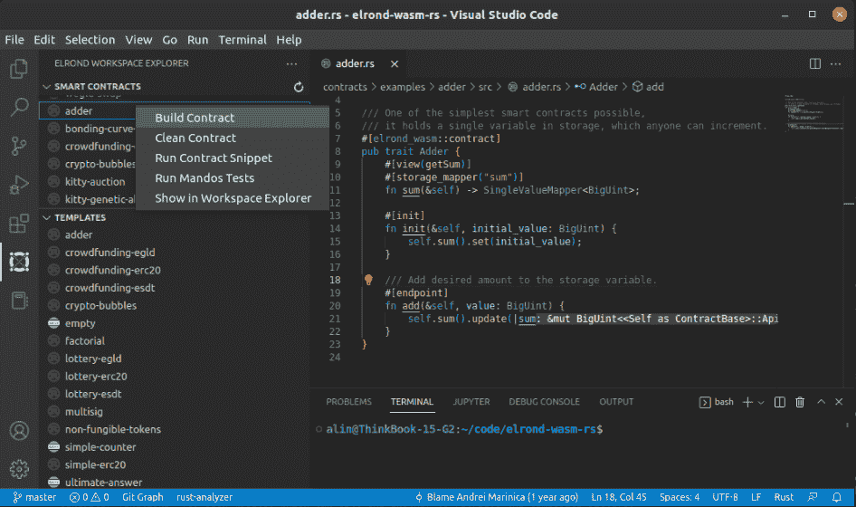

# 智能合同构建参考

> 原文：<https://docs.elrond.com/developers/developer-reference/smart-contract-build-reference>

 ## 如何:基本构建

要创建合同，只需在合同箱中导航并运行即可

```rust
erdpy contract build 
```

或者，您可以转到您安装的`Elrond Workspace Explorer` VS 代码扩展，右键单击您的智能合同，然后单击`Build Contract`



## 如何:多契约构建

### 理

从`elrond-wasm 0.37`开始，可以配置所谓的“多合同构建”。

这个想法是从同一个智能合约项目中产生几个智能合约二进制文件。这些“输出”契约可能共享也可能不共享它们的大部分端点和逻辑，但是它们总是源自相同的代码库。把它们看作是同一份合同的不同版本。

这个系统的主要原理(至少现在)是“外部观点”契约。对于契约来说，有一些端点对于获取链外数据非常有用，但是很少在链上使用，这是很常见的。他们的代码基本上膨胀了主契约，其思想是将它们提取到一个单独的契约中。第二个契约(称为“外部视图契约”)可以工作，因为契约可以直接从其他契约的存储中读取。

该框架在后台自动执行存储访问重新路由。契约代码甚至不能区分来自同一个契约的常规视图和被归入外部视图的视图。更有甚者，同一个视图端点可以在不同的配置/输出契约中既作为外部视图又作为常规视图。

这个组件有可能成为一个更高级的版本控制系统的构建模块，但是我们还没有试验过。

### 配置示例

要获得多契约构建，向智能契约根添加一个`multicontract.toml`文件就足够了。构建的触发方式与基本构建相同。

`multicontract.toml`文件包含关于输出契约是什么的数据，以及什么端点进入哪个。

我们将以多重签名合同为例。在此合同中，我们有几个从未在链上使用的端点:`getPendingActionFullInfo`、`userRole`、`getAllBoardMembers`、`getAllProposers`、`getActionData`、`getActionSigners`、`getActionSignerCount`、`getActionValidSignerCount`。我们希望将这些契约放在外部视图契约中。

为了使配置更容易，我们在代码中对它们进行了标记，如下面的摘录所示:

```rust
#[elrond_wasm::module]
pub trait MultisigStateModule {
    // ...

    /// Serialized action data of an action with index.
    #[label("multisig-external-view")]
    #[view(getActionData)]
    fn get_action_data(&self, action_id: usize) -> Action<Self::Api> {
        // ...
    }

    /// Gets addresses of all users who signed an action.
    #[label("multisig-external-view")]
    #[view(getActionSigners)]
    fn get_action_signers(&self, action_id: usize) -> ManagedVec<ManagedAddress> {
        // ...
    }

    // ...
} 
```

标签除了提供一种便捷的方式来引用`multicontract.toml`中的端点组之外，没有任何作用。

现在来看一下`multicontract.toml`配置本身，注释中有解释:

```rust
[settings]
# one of the output contracts is considered "multisig-main"
# it can have any id
main = "multisig-main"

# contracts are identified by a contract id
# this id is only relevant in this file and in test setup
[contracts.multisig-main]
# the contract name is the important one,
# the output will be <contract-name>.wasm/<contract-name>.abi.json
name = "multisig"
# we can choose to add all unlabelled endpoints to a contract
add-unlabelled = true

# this is the external view contract, here we call it "view"
[contracts.view]
# the output will be multisig-view.wasm/multisig-view.abi.json
name = "multisig-view"
# this is how we signal that this contract will be built as an external view
external-view = true
# we only add the endpoints labelled "multisig-external-view", as in the code snippet above
# any number of labels can be added
add-labels = ["multisig-external-view"]

# this is how you get a version of the contract with all endpoints
# (main and external view, as defined above), 
[contracts.full]
name = "multisig-full"
add-unlabelled = true
add-labels = ["multisig-external-view"] 
```

### 外部查看合同

*外部视图*合同的行为不同于常规合同。框架为这样的契约添加了一些逻辑，这对开发人员来说是不可见的。主要有两点:

1.  存储访问是不同的。所有存储读取都是从构造函数中给定的目标协定中完成的。
2.  构造函数不同。在部署外部视图契约时，请注意这一点。
    *   原始构造函数被忽略，[一个特定的构造函数](https://docs.rs/elrond-wasm/0.36.1/elrond_wasm/external_view_contract/fn.external_view_contract_constructor.html)总是被提供。
    *   该构造函数总是接受一个参数，即要读取的目标协定的地址。从这开始，目标地址不能再改变。
    *   外部视图构造函数 ABI 始终如下:

```rust
{
    "constructor": {
        "docs": [
            "The external view init prepares a contract that looks in another contract's storage.",
            "It takes a single argument, the other contract's address",
            "You won't find this constructors' definition in the contract, it gets injected automatically by the framework. See `elrond_wasm::external_view_contract`."
        ],
        "inputs": [
            {
                "name": "target_contract_address",
                "type": "Address"
            }
        ],
        "outputs": []
    }
} 
```

### 多合同测试

在曼督斯使用这些合同是可能的(也是推荐的),因为它们会在链上使用。

mandos-go 测试将直接使用生成的契约二进制文件。调用在特定输出协定中不可用的端点将会失败，即使所述端点存在于原始协定代码中。

为了在 mandos-rs 测试中达到相同的效果，按照下面的代码片段进行配置。这是 multisig 测试文件之一`multisig_mandos_rs_test.rs`的实际摘录。

```rust
fn world() -> BlockchainMock {
    // Initialize the blockchain mock, the same as for a regular test.
    let mut blockchain = BlockchainMock::new();
    blockchain.set_current_dir_from_workspace("contracts/examples/multisig");

    // Contracts that have no multi-contract config are provided the same as before.
    blockchain.register_contract("file:test-contracts/adder.wasm", adder::ContractBuilder);

    // For multi-contract outputs we need to provide:
    // - the ABI, via the generated AbiProvider type
    // - a mandos expression to bind to, same as for simple contracts
    // - a contract builder, same as for simple contracts
    // - the contract name, as specified in multicontract.toml
    blockchain.register_partial_contract::<multisig::AbiProvider, _>(
        "file:output/multisig.wasm",
        multisig::ContractBuilder,
        "multisig",
    );

    // The same goes for the external view contract.
    // There is no need to specify here that it is an external view,
    // the framework gets all the data from multicontract.toml.
    blockchain.register_partial_contract::<multisig::AbiProvider, _>(
        "file:output/multisig-view.wasm",
        multisig::ContractBuilder,
        "multisig-view",
    );

    blockchain
} 
```

### `multicontract.toml`规格

*   `settings`
    *   `main` -主 wasm 板条箱的合同 id。该合同板条箱的唯一特殊之处在于，它被简单地称为`wasm`，并且它的`Cargo.toml`是所有其他输出合同板条箱中`Cargo.toml`配置的基础。
*   `contracts`地图，由合同 id 索引。每个合同都有:
    *   `name`(可选)-输出合同名称。如果缺少，将使用合同 id。
    *   `external-view` -指定合同应作为外部视图合同构建。如果未指定，则为 False。
    *   `add-unlabelled` -指定应将所有未标记的端点添加到此合同中。如果未指定，则为 False。
    *   `add-labels` -标签列表。所有标有至少其中一个标签的端点都将被添加到合同中。
    *   `add-endpoints` -将直接添加到本合同中的端点名称列表。它绕过了标签系统。
*   `labels-for-contracts` -也可以将标签反向映射到合同。它包含从标签到合同 id 列表的映射。可能比标注地图的合同读起来难一点，但是可以用。它

### 来电`build`

可以通过调用元机箱中的`erdpy contract build <project>`或`cargo run build`来触发构建。事实上，erdpy 将 meta crate 本身称为。

默认情况下，该命令将为每个输出契约生成三个文件:ABI ( `<contract>.abi.json`)、契约(`<contract>.wasm`)和一个 json 文件，其中包含所有使用的 VM EI 导入函数(`<contract>.imports.json`)。对于上面的 multisig 示例，生成的文件如下:

```rust
output
├── multisig-full.abi.json
├── multisig-full.imports.json
├── multisig-full.wasm
├── multisig-view.abi.json
├── multisig-view.imports.json
├── multisig-view.wasm
├── multisig.abi.json
├── multisig.imports.json
└── multisig.wasm 
```

可以在 erdpy 中或直接向`build`命令添加几个参数:

*   `--wasm-symbols`:在编译时不优化掉符号，保留函数名，有利于研究 WAT。
*   `--no-wasm-opt`:构建后不应用`wasm-opt`，这保留了函数名，有利于研究 WAT。
*   `--wat`:还为每个合同输出生成一个 WAT 文件。它通过调用`wasm2wat`来实现。
*   `--no-imports`:默认情况下，不为每个合同生成 EI 导入 JSON 文件。
*   `--wasm-name`后跟名称:用主合同名称替换主合同名称。对二级合同没有任何作用。
*   `--wasm-suffix`后跟后缀:给所有生成的合同添加破折号和后缀。例如:multisig 上的`cargo run build --wasm-suffix dbg`会产生`multisig-dbg.wasm`、`multisig-view-dbg.wasm`和`multisig-full-dbg.wasm`合同。
*   `--target-dir`指定 rust 编译器应该使用哪个目标文件夹。在编译更多契约的情况下，它们共享目标目录会更快，因为不需要为每个契约重新编译公共板条箱。Erdpy 总是显式设置这一点。

### 来电`build-dbg`

为了方便起见，还有另外一个命令:`cargo run build-dbg`。调用这个相当于`cargo run build --wasm-symbols --no-wasm-opt --wasm-suffix "dbg" --wat --no-imports`。对于希望研究编译器生成的 WebAssembly 输出的开发人员来说，这是理想的选择。

multisig 示例中`build-dbg`的输出将为:

```rust
output
├── multisig.abi.json
├── multisig-dbg.wasm
├── multisig-dbg.wat
├── multisig-full.abi.json
├── multisig-full-dbg.wasm
├── multisig-full-dbg.wat
├── multisig-view.abi.json
├── multisig-view-dbg.wasm
└── multisig-view-dbg.wat 
```

它接受来自`build`的所有参数，所以`--target-dir`在这里也适用。

### 来电`clean`

调用元板条箱中的`erdpy contract clean <project>`或`cargo run clean`将删除`output`文件夹，并清除铁锈板条箱的输出。

### 来电`snippets`

在 meta crate 中调用`cargo run snippets`将在 contract 主目录中创建一个名为`interact-rs`的项目，包含自动生成的样板代码，用于为当前合同构建一个交互器。

一个交互器是一个小工具，它是为开发者设计的，用来与合同进行交互。它是用 Rust 编写的，非常适合直接从合同项目中快速交互和修改。将会有更多关于这个主题的文档。

## 合同建立流程深潜

本节为那些想更深入了解该系统的人提供了一个概述。如果你只是想建立一些合同，可以跳过这一步。

构建一个契约是一个复杂的过程，但幸运的是它被框架以不可见的方式处理。我们将一步一步地介绍这些组件，并给出这种架构的一些理由。

### a .智能合约本身

智能契约被定义为没有实现的特征。这很好，因为这意味着契约可以在各种平台上执行。一些实现由`[elrond_wasm::contract]`宏自动生成。

然而，并不是所有的事情都可以在这里进行。值得注意的是，宏不能从其他模块或板条箱中访问数据，所有处理都在当前合同或模块中进行。因此，我们需要另一种机制来处理完整的合同数据。

### b .【生成的】ABI 生成器

ABIs 是关于合同的 metatada 的集合。为了构建 ABI，我们还需要来自模块的数据。模块宏不能从合同宏中调用(宏在编译时运行，我们甚至不确定模块是否需要重新编译！).然而，模块可以被调用。这就是为什么我们实际上在为每个模块生成 *ABI 生成器函数*，这些函数可以相互调用来检索合成图像。

注意:ABI 生成器是 trait[ContractAbiProvider](https://docs.rs/elrond-wasm/latest/elrond_wasm/contract_base/trait.ContractAbiProvider.html)的一个实现。

### c .元板条箱:生成 ABI

下一个问题是如何调用这个函数。每当我们编制 WASM 合同时，我们也以 JSON 格式编制 ABIs。Rust 有一个叫做构建脚本的东西，它在编译一个项目后被叫做*，但是由于稍后将变得明显的原因，它们对于我们的用例来说不够强大。*

因此，我们决定在每个智能合同项目中包含一个额外的板条箱。它总是在契约的`meta`文件夹中，并且处理整个构建。为了尽量减少样板文件，它总是只包含一行，只是简单地将执行推迟到框架:

```rust
fn main() {
    elrond_wasm_debug::meta::perform::<my_contract_crate::AbiProvider>();
} 
```

要产生 ABI，事实上，它足以称之为:

```rust
cd meta
cargo run 
```

元箱可以访问 ABI 生成器，因为它始终依赖于合同箱。这就是上例中的`my_contract_crate::AbiProvider`。

这也是 meta crate 解析和处理`multicontract.toml`文件的步骤。如果有多个输出，将为每个输出生成一个 ABI。

### d. Meta 货箱:生成`wasm`货箱代码

每个合同必须包含至少一个`wasm`板条箱。这与合同箱是分开的，因为它有不同的目的:它只需要作为编译 wasm 的基础。请将它作为契约逻辑和 Rust to WASM 编译器之间的中间步骤。这也是指定 WASM 编译选项的地方(例如优化级别)。这些选项可以在`wasm`箱的`Cargo.toml`文件中看到。

这种分离是有帮助的，因为通过这种方式，智能合同箱可以充当一个没有 WebAssembly 知识的纯 Rust 箱。这使得测试和覆盖变得容易，并且能够与其他不相关的技术集成。

板条箱没有给智能合同添加任何有意义的代码。他们需要做的一切就是为 WASM 函数语法提供一个适配器。更具体地说，它们为每个期望的端点公开一个外部函数，该函数将执行转发给相应的智能契约方法。

如果我们不小心，我们就有可能在合同中添加不必要的端点。一个经典的例子是，我们有一个包含多个模块的机箱，其中只有一个模块被导入到智能合同中。在一些旧版本中，您可能会从该机箱的其他模块中获得不需要的端点。为了避免这种情况，我们使用 ABI 在每个`wasm`机箱中生成一个精选的端点列表。这样，我们的合同总是具有与 ABIs 中指定的完全相同的端点。

这需要代码生成。这个`meta`箱也将处理这个代码生成。下面是这样生成的代码的一个例子:

```rust
// Code generated by the elrond-wasm multi-contract system. DO NOT EDIT.

////////////////////////////////////////////////////
////////////////// AUTO-GENERATED //////////////////
////////////////////////////////////////////////////

// Number of endpoints: 2

#![no_std]

elrond_wasm_node::wasm_endpoints! {
    adder
    (
        getSum
        add
    )
}

elrond_wasm_node::wasm_empty_callback! {} 
```

宏有助于将生成的代码保持在最低限度。

对于多合同构建，需要为每个输出合同生成一个`wasm`板条箱:

*   主 wasm 板条箱必须始终位于`wasm`文件夹中。源文件是自动生成的，但是`Cargo.toml`必须由开发者提供。
*   其他 wasm 合同(称为“二级”)接收以`wasm-`开头的板条箱文件夹，例如`wasm-multisig-view`。这些板条箱完全基于`multicontract.toml`的数据生成。各个`Cargo.toml`文件基于主 wasm 机箱的`Cargo.toml`。除了板条箱名称之外，所有配置都是从那里获取的。
*   警告:任何以`wasm-`开头的未说明的文件夹都将被删除，不会给出提示。这是为了在重命名时保持文件夹结构的整洁。

### e .元板条箱:实际 WASM 打造

前两步只需调用 meta crate 中的`cargo run`即可，但是要执行构建，必须调用`cargo run build`。

有了 ABI 信息和生成的代码，meta crate 现在可以构建所有的 WASM 契约，每个输出契约一个。

rust 编译器将结果放在指定的`target`文件夹中，但是为了方便起见，meta crate 将可执行文件移动到项目`output`文件夹中，并根据配置的名称对它们进行重命名。

您可能已经从 erdpy 中自动执行了这个步骤，但是 erdpy 只是调用 meta crate 来完成这个工作。这是因为在这一点上，只有元板条箱可以访问 ABIs，并且可以轻松地完成它。

### f .元板条箱:构建后处理

在构建契约之后，根据编译后的 WebAssembly 输出，还剩下三个操作要执行:

1.  使用`wasm-opt`优化所有合同。可以禁用该操作(通过`--no-wasm-opt`)。
2.  为每个合同生成的 WAT 文件 id。默认不启用，可以启用(通过`--wat`)。框架简单地调用`wasm2wat`工具来完成这项工作。
3.  为每个合同生成一个`.imports.json`文件。可以禁用(通过`--no-imports`)。框架使用`wasm-objdump`工具来检索导入。它解析输出并将其保存为 JSON。

### g .清洁工程

在元板条箱中调用`cargo run clean`将在所有 wasm 板条箱中运行`cargo clean`并删除`output`文件夹。

`erdpy contract clean`也只是转发到这。

请注意，即使是清洁操作也依赖于 ABI，以便触及所有 wasm 板条箱。

### 构建流程总结

概括地说，构建过程的步骤如下:

1.  使用合同/模块宏生成代码，包括 ABI 生成器；
2.  调用 ABI 生成器，在内存中生成一个 ABI；
3.  解析`multicontract.toml`文件(如果存在)；
4.  基于此决定哪些端点去往哪些输出契约；
5.  将 ABI 作为 JSON 保存在输出文件夹中(每个输出合同一个)；
6.  为所有输出合同生成 wasm 板条箱(生成的所有源，Cargo.toml 内容从主 wasm 板条箱复制)；
7.  建造所有 wasm 板条箱；
8.  将二进制文件从`target`文件夹复制到`output`。
9.  对每个合同进行后处理:`wasm-opt`、`wasm2wat`、导入；

幸运的是，该框架可以自动完成所有这些工作，只需点击一下鼠标。